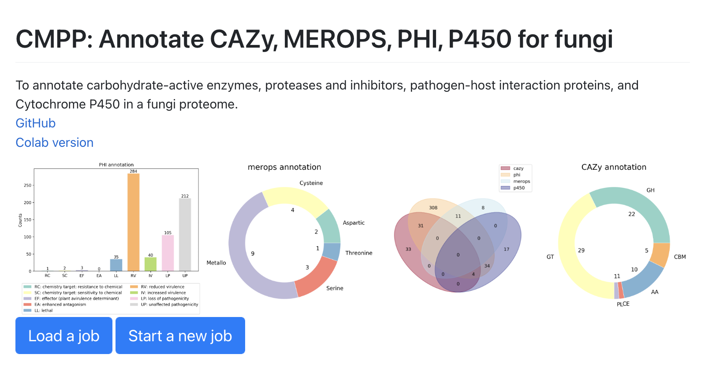

# CMPP
**Annotate C(CAZy)M(MEROPS)P(PHI)P(P450) for fungi.**  
Dependency: ncbi-blast (v2.9 or higher), hmmscan, venn and [functional](http://185.201.226.155/CMPP/functional.tar.gz)  
blastp need to support v5 database, hmmscan is part of HMMER and install venn using pip.  
## Install
Clone repo to local and download functional database.  
```bash
git clone https://github.com/JinyuanSun/CMPP.git
cd CMPP
wget http://185.201.226.155/CMPP/functional.tar.gz
tar vxzf functional.tar.gz
```
## Run CMPP pipeline
```bash
./run_CMPP_anno.sh -i $protein.fas -d functional
```
Check the output in `CMPP_out`.

## A web app for biologists [link](http://103.79.79.101:8070/)
Simple cilck the start a new job button and upload a fasta file.


## It also available via [CoLab](https://colab.research.google.com/github/JinyuanSun/CMPP/blob/main/ColabCMPP.ipynb).  
In this CoLab notebook, you can upload a custom fasta file conatining a proteome or directly download a proteome from NCBI.  

## TODO
1. Add Signal peptide and TMHMM prediction for proteases and CAZy.
